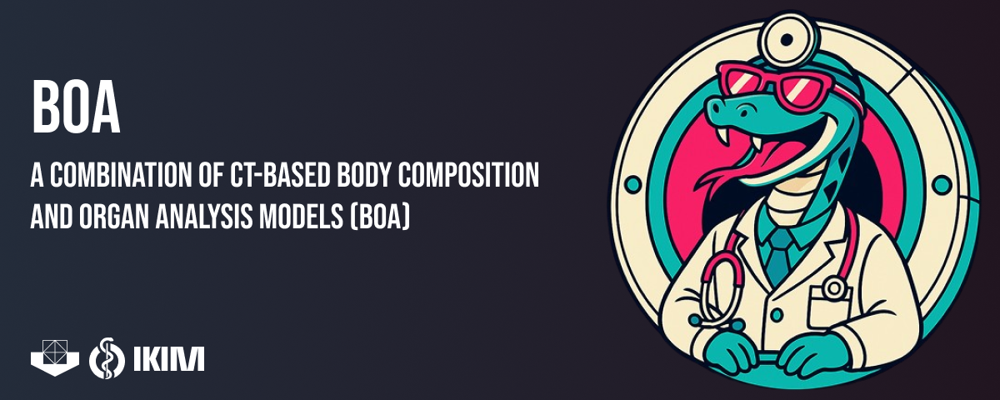

# BOA: Body and Organ Analysis


[](https://doi.org/10.1097/RLI.0000000000001040)
[](LICENSE)
[](https://www.python.org/)
[](https://docs.astral.sh/uv/)
[](https://github.com/UMEssen/Body-and-Organ-Analysis/releases)

---

BOA is a tool for segmentation of CT scans developed by the [SHIP.AI group at
the Institute for Artificial Intelligence in Medicine
(IKIM)](https://ship-ai.ikim.nrw/). Combining the
[TotalSegmentator](https://arxiv.org/abs/2208.05868) and the
[Body Composition Analysis](https://pubmed.ncbi.nlm.nih.gov/32945971/), this
tool analyzes medical images and identifies the different structures within the
human body, including bones, muscles, organs, and blood vessels. It also
includes functionalities for the following tasks:

- Skeleton
- Organs
- Bone Mineral Density
- Contrast Media Recognition
- Cardiovascular System
- Body Parts
- Body Tissue Composition
- Body Region Detection

BOA can be used in two ways:

- as a **command line tool** that runs every segmentation in one go on a single
  CT (no PACS required), or
- as a **PACS integration** that receives DICOM studies, segments them
  automatically, and pushes the results back to your infrastructure.

> **Platform support.** BOA inference runs on **Linux** and **Windows**
> (Docker Desktop / WSL2), either with an NVIDIA GPU or **CPU-only** (no GPU
> required, just slower). macOS is **not** supported for inference at this time.

## Example segmentations

BOA can generate full-body segmentations of CT scans:


The generated segmentations can additionally be used as input to produce
realistic renderings with
[Siemens' Cinematic Rendering](https://www.siemens-healthineers.com/digital-health-solutions/cinematic-rendering):


## Requirements

- [Docker](https://docs.docker.com/get-docker/) with Compose v2.
- An NVIDIA GPU with the
  [NVIDIA Container Toolkit](https://docs.nvidia.com/datacenter/cloud-native/container-toolkit/latest/install-guide.html)
  for GPU inference (≥ 16 GB GPU memory is sufficient for our tests). A GPU is
  recommended but **not required** — BOA also runs **CPU-only**, just
  considerably slower. (Triton-based CPU acceleration is planned but not
  available yet.)
- Some of the advanced models require a free
  [TotalSegmentator license](https://backend.totalsegmentator.com/license-academic/)
  (see [Models](#models)).

The prebuilt images are published on Docker Hub under the `shipai/` namespace:
`shipai/boa-cli`, `shipai/boa-orthanc`, `shipai/boa-rabbitmq`,
`shipai/boa-worker-gpu`, and `shipai/boa-worker-cpu`.

## Command line tool

Use the CLI to segment a single study without connecting to a PACS.

Pull the image:

```bash
docker pull shipai/boa-cli
```

or clone the repository and build it yourself:

```bash
source scripts/generate_version.sh
docker build -t shipai/boa-cli --file scripts/cli.dockerfile .
```

Then run it. The image bind-mounts an input (NIfTI file **or** a DICOM
directory), an output directory, and a host directory for the model weights so
they are cached between runs. Ownership of the outputs is controlled by
`DOCKER_USER` (`uid:gid`); do **not** use `--user`, as that bypasses the
container entrypoint that fixes file permissions.

```bash
docker run --rm \
    -v "$INPUT":/dicoms \
    -v "$OUTPUT_DIR":/workspace \
    -v "$LOCAL_WEIGHTS_PATH":/app/weights \
    --gpus all \
    --shm-size=8g --ulimit memlock=-1 --ulimit stack=67108864 \
    -e DOCKER_USER="$(id -u):$(id -g)" \
    shipai/boa-cli \
    python -m body_organ_analysis \
        --input-image /dicoms \
        --output-dir /workspace \
        --models total+bca \
        --verbose
```

- `$INPUT` is either a DICOM directory or a single `.nii.gz` file (mount it to
  `/dicoms` or, for a NIfTI, e.g. `/dicoms/image.nii.gz` and point
  `--input-image` at it).
- `$OUTPUT_DIR` is where the results are written.
- On Linux you may use `--runtime=nvidia` instead of `--gpus all`; to pin a
  specific GPU use `--gpus '"device=0"'`.
- For **CPU-only** runs drop `--gpus all` and pass `-e DEVICE=cpu`. The
  `--fast-bca`/`--fast-total` modes are **strongly recommended** on CPU to keep
  runtimes reasonable; even so, expect considerably longer runtimes than on a GPU.

### Useful CLI options

Run `python -m body_organ_analysis --help` for the full list. The most common:

| Option | Purpose |
| --- | --- |
| `-m`, `--models` | Plus-separated models to run, e.g. `total+bca`, or `all`. Required. See [Models](#models). |
| `-d`, `--device` | `gpu`, `cuda`, `gpu:<id>`, `cuda:<id>`, or `cpu`. |
| `-l`, `--license_number` | TotalSegmentator license number (needed for some models). |
| `--fast-total` | Run TotalSegmentator in fast mode. |
| `--fast-bca` | Use the single-fold BCA variant instead of the 5-fold ensemble. |
| `--bca-no-pdf` | Skip the PDF report; still write the `bca-measurements.json`. |
| `--bca-examined-body-region` | Limit the BCA report to `abdomen`, `neck`, or `thorax`. |
| `--cnr-adjustment` | Add a CNR-adjusted Excel sheet for supported regions (aorta + autochthon from `total`). The pulmonary artery measurement additionally requires `heartchambers_highres`; without it, that one column is skipped and a warning is logged. |
| `--skip-contrast-information` | Skip IV-phase / GIT-contrast prediction. |
| `--theme` | `light` (default) or `dark` for the BCA PDF. |
| `-p`, `--preview` | Generate a PNG preview of the TotalSegmentator output. |
| `-r`, `--radiomics` | Also compute radiomics features (experimental). |
| `--use-study-prefix` | Prefix every output file with the input file name. |
| `-v`, `--verbose` | Print BOA progress logs. |

Most flags also have an environment-variable equivalent that is useful for the PACS
integration: `DEVICE`, `THEME`, `LICENSE_NUMBER`, `FAST_BCA`,
`FAST_TOTAL`, `BCA_NO_PDF`, `SKIP_CONTRAST_INFORMATION`, and `VERBOSE`
(booleans accept `1`/`true`).

## PACS integration

For automated, hands-off processing, deploy the Compose stack: an Orthanc DICOM
receiver queues each incoming series through RabbitMQ to a Celery worker, which
runs the segmentation and pushes the results to a local folder, an SMB share,
and/or a DicomWeb endpoint. An optional PostgreSQL database collects per-task
statistics for monitoring.

```text
DICOM sender ──► Orthanc ──► RabbitMQ ──► worker (GPU or CPU) ──► outputs
                                                                 ├── local folder
                                                                 ├── SMB share (Excel + report)
                                                                 └── DicomWeb (DICOM-SEG)
```

A single, cross-platform [docker-compose.yml](docker-compose.yml) drives the
whole stack on both Linux and Windows. See the
[PACS integration guide](documentation/pacs_integration.md) for the full
deployment walkthrough, the environment-variable reference, monitoring setup,
and the list of produced outputs.

Quick start:

```bash
# 1. Configure the stack (copy and edit the sample).
cp .env_sample .env

# 2. Build the images and start the services.
docker compose build orthanc rabbitmq worker-gpu
docker compose up -d orthanc rabbitmq worker-gpu monitoring
```

Use `worker-cpu` instead of `worker-gpu` if you do not have a local GPU; it runs
the same segmentations on the CPU (slower). On CPU, enabling the fast modes
(`FAST_TOTAL=true` / `FAST_BCA=true`) is strongly recommended to keep runtimes
reasonable.

## Models

Select models with `--models` (CLI) or the `PACS_MODEL` environment variable
(PACS stack), as a `+`-separated list or `all`. Unknown names are rejected on
the CLI and dropped with a warning in the PACS stack. Requesting `bca`
automatically adds `total`, because BCA depends on it. `all` runs every model in
the table below; `heartchambers_highres` is licensed and is included in `all`
**only when a valid license** (`-l`/`--license_number` or `LICENSE_NUMBER`) is
supplied — otherwise request it explicitly by name (e.g.
`total+heartchambers_highres`).

| Model | Output | Notes |
| --- | --- | --- |
| `total` | `total.nii.gz` | Full-body TotalSegmentator (100+ structures). |
| `body_parts` | `body_parts.nii.gz` | Body and extremities. |
| `bca` | `tissues.nii.gz`, `body_regions.nii.gz`, `report.pdf` | Body Composition Analysis. Implicitly adds `total`; always runs `body_parts` + `body_regions` internally. |
| `lung_vessels` | `lung_vessels_airways.nii.gz` | Lung vessels and airways. |
| `cerebral_bleed` | `cerebral_bleed.nii.gz` | Intracerebral hemorrhage. |
| `hip_implant` | `hip_implant.nii.gz` | Hip implant. |
| `liver_segments` | `liver_segments.nii.gz` | Couinaud liver segments. |
| `liver_vessels` | `liver_vessels.nii.gz` | Liver vessels and tumor. |
| `pleural_pericard_effusion` | `pleural_pericard_effusion.nii.gz` | Pleural / pericardial effusion. |
| `heartchambers_highres` | `heartchambers_highres.nii.gz` | High-resolution heart chambers. Added to `all` only with a valid license; otherwise request explicitly. Needed for the pulmonary artery column of the `--cnr-adjustment` sheet. |

Several of the specialized models (e.g. `heartchambers_highres`,
`liver_vessels`, `lung_vessels`, `pleural_pericard_effusion`) require a
[TotalSegmentator license](https://backend.totalsegmentator.com/license-academic/),
passed with `-l/--license_number` or the `LICENSE_NUMBER` environment variable.

## Outputs

Every run produces an `output.xlsx` workbook (renamed to
`AccessionNumber_SeriesNumber_SeriesDescription.xlsx` in the PACS stack) with a
subset of the following sheets:

| Sheet | When |
| --- | --- |
| `info` | Always — patient/study metadata, BOA version, contrast prediction. |
| `regions-statistics` | When `total` (or another measured model) is run — per-region volume and statistics. |
| `cnr-adjusted` | With `--cnr-adjustment` — image-quality-adjusted measurements. |
| `bca-aggregated-measurements` | With `bca` — aggregated tissue measurements (also shown in the report). |
| `bca-slice-measurements` | With `bca` — per-slice tissue volumes. |
| `bca-slice-measurements_no_ext` | With `bca` — the same, with extremities excluded. |

Alongside the workbook you get the segmentation NIfTIs, a `report.pdf` (BCA),
`preview_total.png`/`.pdf`, and `*-measurements.json` files. In the PACS stack,
the Excel/report can be uploaded to an SMB share and the segmentations to a
DicomWeb endpoint as DICOM-SEG objects.

## Performance

To estimate the compute and time required to process a study, see the
[runtime table](https://github.com/wasserth/TotalSegmentator/blob/master/resources/imgs/runtime_table.png)
provided by TotalSegmentator. For very large series (e.g. 1600 slices at 1 mm)
performance can be worse and more CPU power may be needed. According to our
tests, 16 GB of GPU memory is sufficient.

## Citation

If you use this tool, please cite the following papers:

[BOA](https://journals.lww.com/investigativeradiology/abstract/9900/boa__a_ct_based_body_and_organ_analysis_for.176.aspx):

```text
Haubold, J., Baldini, G., Parmar, V., Schaarschmidt, B. M., Koitka, S., Kroll,
L., van Landeghem, N., Umutlu, L., Forsting, M., Nensa, F., & Hosch, R. (2023).
BOA: A CT-Based Body and Organ Analysis for Radiologists at the Point of Care.
Investigative radiology, 10.1097/RLI.0000000000001040. Advance online
publication. https://doi.org/10.1097/RLI.0000000000001040
```

[TotalSegmentator](https://pubs.rsna.org/doi/10.1148/ryai.230024):

```text
Wasserthal J, Breit H-C, Meyer MT, et al. TotalSegmentator: Robust Segmentation
of 104 Anatomic Structures in CT Images. Radiol. Artif. Intell. 2023:e230024.
Available at: https://pubs.rsna.org/doi/10.1148/ryai.230024.
```

[nnU-Net](https://www.nature.com/articles/s41592-020-01008-z):

```text
Isensee F, Jaeger PF, Kohl SAA, et al. nnU-Net: a self-configuring method for
deep learning-based biomedical image segmentation. Nat. Methods.
2021;18(2):203–211. Available at: https://www.nature.com/articles/s41592-020-01008-z.
```

## License

BOA is released under the Apache License 2.0. See [LICENSE](LICENSE). The
underlying TotalSegmentator models carry their own license terms.
