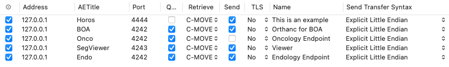

# PACS Integration

## How does it work?
- The user sends a study to the BOA.
- The study is received by the Orthanc instance, which then creates a task.
- The task is picked up by a task management system, which then starts the segmentations and the computation of the Excel file with the measurements.
- If specified, the segmentations are saved locally and uploaded to the DicomWeb instance.
- If desired, we can provide an additional system where the segmentations can be viewed. Just write us an email.
- If specified, the Excel file is saved locally and uploaded to an SMB share.
- The user can then download the Excel file from the SMB share and look at the segmentations on the DicomWeb instance. The segmentations and the Excel file are also available in the specified local folder.
- If no local output folder was specified, the folder where the computations were originally performed is deleted.

Set the `GIT_VERSION` and `PACKAGE_VERSION` variables (used for debugging in case there are problems):
```
source scripts/generate_version.sh
```

Load the docker images:
```bash
docker pull shipai/boa-orthanc
docker pull shipai/boa-rabbitmq
docker pull shipai/boa-task-gpu
docker pull shipai/boa-task # Only needed if you are using a triton instance for the models
```
or clone the repository and build the images. If you are doing this, please set up the environment variables as described above first.
```bash
docker compose build orthanc rabbitmq worker-gpu
```

Download the [docker-compose.yml](../docker-compose.yml) file and run the following command
```bash
docker compose up orthanc rabbitmq worker-gpu -d
```
with `worker-gpu` if you want to use a local GPU and `worker` if you have Triton instance running.  Remove `rabbitmq` in case you already have an instance running.

### !!!IMPORTANT!!! for Windows users:
if you are using Windows, substitute the `docker-compose` with `docker -f docker-compose-win.yml` (or rename `docker-compose-win.yml` to `docker-compose.yml`). There seems to be a problem with using the environment variables in the paths (as in these [two rows](https://github.com/UMEssen/Body-and-Organ-Analysis/blob/main/docker-compose-win.yml#L45)). If that does not work, please substitute the variables with the strings that you have defined in the `.env` files.
Also, the package seems to be broken if built using Windows, so **please use the images from DockerHub**!

`docker-compose-win.yml` has not been tested extensively so if you have any problems please contact us!

### Send a study to the BOA
You can then add the instance to your PACS of choice by adding `{YOUR_IP}` and the port `4242` to the location manager to your PACS. Below there is a screenshot of how this looks in Horos.

<div align="center">
  Example in Horos:
  <br>
  <a href="https://horosproject.org/">
    
  </a>
</div>

In this case, the IP is the same as the one of my machine because I am testing locally. The AETTitle that you specify will be the name of the folder where the results will be stored, so you that can create different endpoints to computed different cohorts.

## Notes on RabbitMQ
RabbitMQ always checks whether the tasks have been received by the consumer, and if the consumer takes too long, the tasks are going to be killed. This is a problem in our case, because the tasks may take more time to complete, and if 40-50 studies have been sent at the same time, they are going to be killed by RabbitMQ because they have not yet been completed. This can be set with the `timout_consumer` variable of RabbitMQ, and since this highly depends on the amount of studies that are being sent in one go, we decided to disable this variable. This is done by creating a file in `/etc/rabbitmq/advanced.config` with the following content.

```
%% advanced.config
[
  {rabbit, [
    {consumer_timeout, undefined}
  ]}
].
```

If you are using your own RabbitMQ instance, please also use this setting, or contact us if you have a better idea!

## Outputs

The outputs of BOA are listed below, all of them will appear in the `SEGMENTATION_DIR` folder, some of them will be uploaded to SMB and some will be uploaded with DicomWeb, if they are configured.
Currently, the produced DICOM-segs have placeholders for the anatomical names of the tissues.
- Segmentations (BCA and TotalSegmentator), present in `SEGMENTATION_DIR` and uploaded to DicomWeb (optional).
  - Total Body Segmentation (`total.nii.gz`): Segmentation of 104 body regions ([TotalSegmentator](https://arxiv.org/abs/2208.05868)).
  - Intracerebral Hemorrhage Segmentation (`cerebral_bleed.nii.gz`).
  - Lung Vessels and Airways Segmentation (`lung_vessels_airways.nii.gz`): Segmentation of trachea/bronchia/airways ([paper](https://www.sciencedirect.com/science/article/pii/S0720048X22001097)).
  - Liver Vessels and Tumor Segmentation (`liver_vessels.nii.gz`).
  - Hip Implant Segmentation (`hip_implant.nii.gz`).
  - Coronary Arteries Segmentation (`coronary_arteries.nii.gz`): Segmentation of the coronary arteries.
  - Pleural Pericardial Effusion Segmentation (`pleural_pericard_effusion.nii.gz`): pleural effusion ([paper](https://journals.lww.com/investigativeradiology/Fulltext/2022/08000/Automated_Detection,_Segmentation,_and.8.aspx)), pericardial effusion (cite [paper](https://www.mdpi.com/2075-4418/12/5/1045)).
  - Body Regions Segmentation (`body-regions.nii.gz`): Segmentation of the body regions ([BCA](https://pubmed.ncbi.nlm.nih.gov/32945971/)).
  - Body Parts Segmentation (`body-parts.nii.gz`): Segmentation of body and extremities.
  - Tissue Segmentation (`tissues.nii.gz`): Segmentation of the tissues ([BCA](https://pubmed.ncbi.nlm.nih.gov/32945971/)).
- Measurements/Reports, present in `SEGMENTATION_DIR` and uploaded to SMB (optional).
  - `AccessionNumber_SeriesNumber_SeriesDescription.xlsx`: Excel file with all the measurements from the BCA and the TotalSegmentator. The `info` sheet contains general information about the patient, such as IDs, dates, DICOM tags, contrast phase, the BOA version. The `region_statistics` sheet has information about the segmentations that were computed together with their volume and some other statistical information. `bca-aggregated-measurements` contains all the measurements for the aggregated regions of the BCA, which are also visible in the report. `bca-slice-measurements` contains information about the volume of each tissue for each slice of the CT scan. `bca-slice-measurements-no-limbs` contains the same information, but the extremities are removed from the computation.
  - `report.pdf`: Report of the BCA findings.
  - `preview_total.png`: Preview of the TotalSegmentator segmentation.
- Other files containing measurements are also stored in the output directory (in `.json` format), and are not uploaded anywhere else. These measurements all appear in the resulting Excel report.
